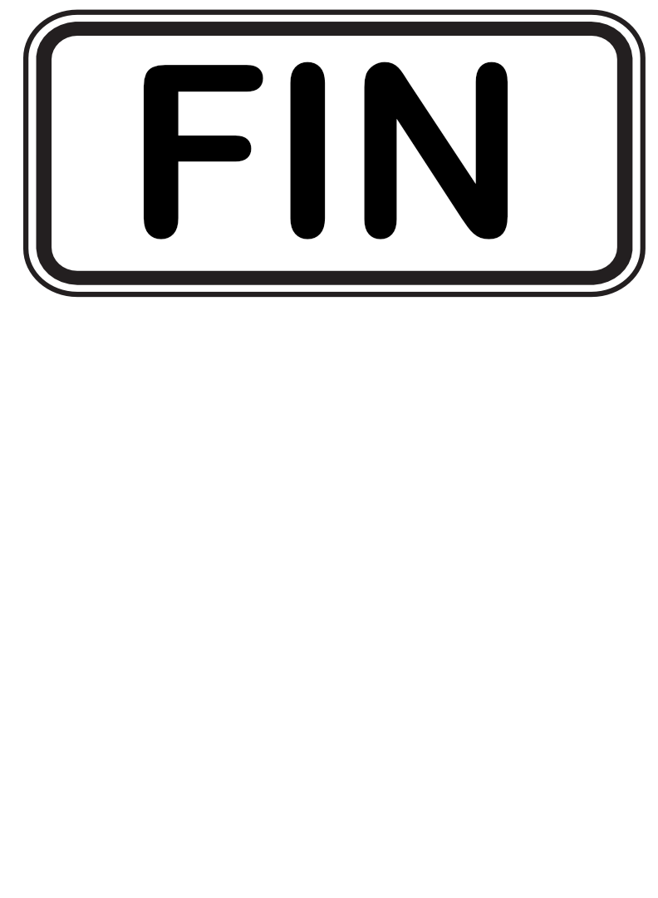

<p align="Center"></p>
<h3 align="Center">2Q2 - Développement Assembleur</h3>

# 🏋️‍♀️ Exercices 04 - Procédures 🏋️‍♀️

#### 📁 [Structures de projets et consignes à suivre](../../includes/rules.md)

## 🚀 Question 01 - La NASA

La NASA vous a octroyé un contrat de programmation pour une procédure d'affichage du décompte pré-lancement d'une fusée, nommée `display`. Cette procédure doit afficher `Attention: X`, où X est le chiffre passé en paramètre (numérique). La procédure affichera `Décollage !!!` lorsque le chiffre passé en paramètre sera égal à zéro (`0`).

La procédure `main` fera une boucle en passant à la fonction `display` la valeur de 9 à 0.

### Affichage attendu :
```plaintext
Attention: 9
Attention: 8
Attention: 7
Attention: 6
Attention: 5
Attention: 4
Attention: 3
Attention: 2
Attention: 1
Décollage !!!
```

### Règles à respecter :
1. Effectuez le passage des paramètres par la pile.

## 🎨 Question 02 - Pablo Picasso del Procedure

Demandez à l'utilisateur la taille du triangle à dessiner, entre 2 et 9.
Dessinez le triangle demandé en utilisant les procédures suivantes :
1. __print_char__ : affichage d'un caractère à l'écran.
2. __print_line__ : affichage d'une ligne de caractères.
3. __print_triangle__ : affichage complet du triangle.

###### Affichage requis :

```plaintext
Entrez la taille du triangle à dessiner [2 à 9] : 9
*********
********
*******
******
*****
****
***
**
*
```

```plaintext
Entrez la taille du triangle à dessiner [2 à 9] : 2
**
*
```

### Règles à respecter :
1. Effectuez le passage des paramètres par la pile.
2. Conservez chacune des procédures __pures__.

## ☀️ Question 03 - Bonne journée !

Créez d'abord une procédure `greeting` qui prendra en paramètre uniquement un nom __(une chaîne de caractères)__ et qui souhaitera une bonne journée à cette personne. La procédure `greeting` appellera, en interne, la procédure `alpha_count`, responsable de retourner le nombre de caractères alphabétiques dans une chaîne de caractères.

```plaintext
Entrez votre nom : Cédrik
Bonjour Cédrik, votre prénom contient 6 lettres !
```

```plaintext
Entrez votre nom : Marie-Antoine
Bonjour Marie-Antoine, votre prénom contient 12 lettres !
```

> Que remarquez-vous de différent avec Marie-Antoine qui fait que vous devrez probablement ajuster votre procédure de calcul du nombre de lettres d'une chaîne de caractères ?

### Règles à respecter :
1. Effectuez le passage des paramètres par la pile.
2. Conservez chacune des procédures __pures__.

## ⚡ Question 04 - Power !

Demandez une base (entre 1 et 9) ainsi qu'une puissance (entre 1 et 5) à l'utilisateur.
Dans une procédure __power__, effectuez le calcul et retournez le résultat.
Affichez ensuite le résultat dans le registre BX.

```plaintext
Entrez la base : 2
Entrez l'exposant : 8
; Valeur du registre BX : 256
```

```plaintext
Entrez la base : 9
Entrez l'exposant : 5
; Valeur du registre BX : 59049
```

### Règles à respecter :
1. Effectuez le passage des paramètres par la pile.
2. Conservez chacune des procédures __pures__.

## ⚡⚡⚡ DÉFI Question 05 - SuperPower !

Affichez maintenant le résultat à l'écran.

```plaintext
Entrez la base : 9
Entrez l'exposant : 5
Résultat : 59049
```

> ⚠️ Vous aurez besoin d'une procédure dédiée à l'affichage d'une valeur numérique à l'écran.

### Règles à respecter :
1. Effectuez le passage des paramètres par la pile.
2. Conservez chacune des procédures __pures__.

<hr><p align="Center"></p>
